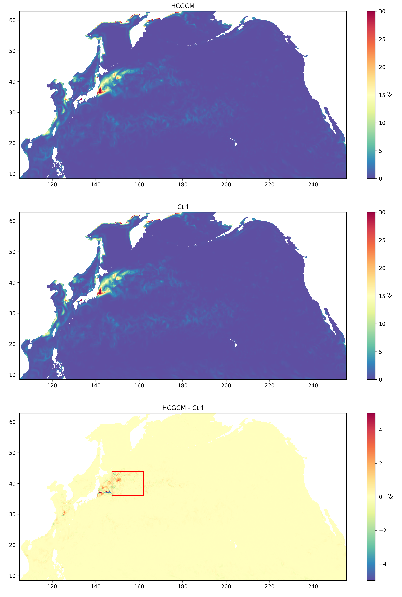
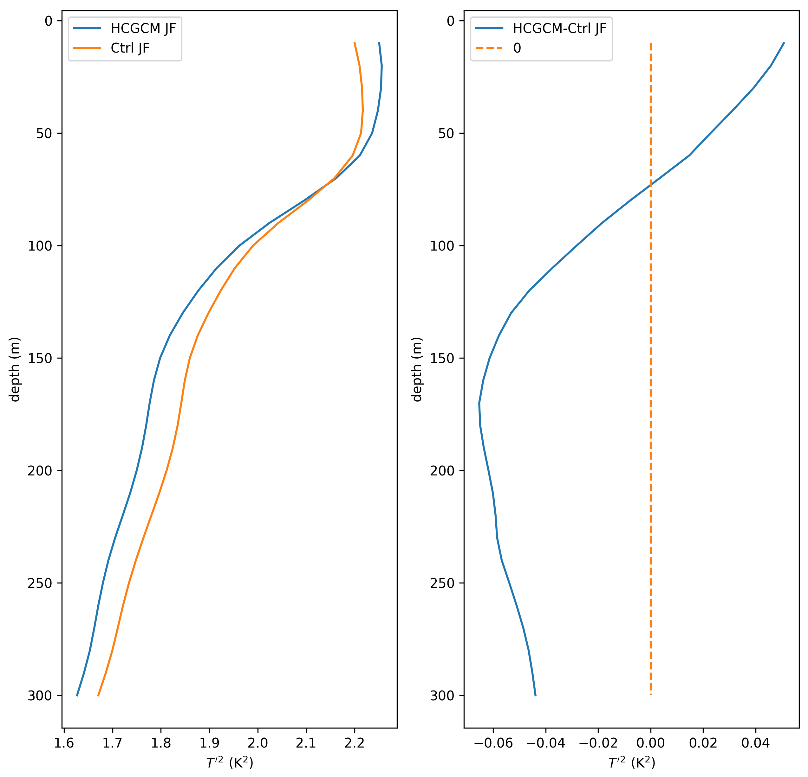
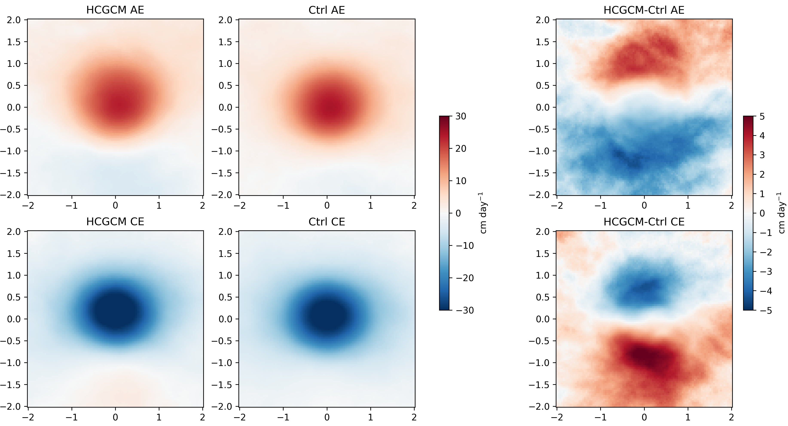

# HC-ROMS

## Introduction
Hybrid Coupled Regional Ocean Modeling System (HC-ROMS) is a new coupled modeling system built upon the Regional Ocean Modeling System ([ROMS](https://www.myroms.org/)) and an empirical atmospheric model.

### Empirical Atmospheric Models
In Empirical atmospheric models, the response of the sea surface atmospheric fields, e.g., 2m air specific humidity ($q$), 2m air temperature ($T_{air}$), and 10m wind speed ($U_{10}$), to ocean forcing is simplified as an empirical relationship, which significantly reduces the computation burden and provides a feasible tool for studying the influence of mesoscale air-sea interaction on ocean dynamic process.

## Modified Code
HC-ROMS are designed based on ROMS.
- ### Switch
    The HC-ROMS can be turned on/off by *HCGCM* in **ROMS_APPLICATION.h**(e.g., [test_hcgcm.h](CaseExample/test_HCGCM/test_hcgcm.h)). In Addition, we set separate switches for $q$, $T_{air}$, $U_{10}$ for Control Variable.
- ### Input
    The $\beta$, response of $q$, $T_{air}$, and $U_{10}$ to mesoscale sea surface temperature ($T'$) are calculated in advance based on the empirical relationship you haven chosen. And you can set $\beta$ input files by *FRCNAME* in **ROMS_APPLICATION.in**(e.g., [test_HCGCM.in](CaseExample/test_HCGCM/test_HCGCM.in)).   
- ### Spatial filter
    The spatial filter is designed to get the $T'$ online in ROMS and is control by [**HCGCM.in**](CaseExample/test_HCGCM/HCGCM.in).
- ### How to run
    All modified Fortran code are listed in [**HC-ROMS_code**](HC-ROMS_code). And you just need to replace the corresponding file in ROMS source code with the file we modified. For more details, you can see [**Case Example**](#case-example).

## Case Example
In these cases, we run a using-HC-ROMS case (HCGCM) and a non-using-HC-ROMS case (Ctrl) with the same atmospheric forcing, separately.

### Model Configuration
The simulations are configured over 105$\degree$- 255$\degree$E and 8$\degree$- 63$\degree$N, with a horizontal resolution ~9 km and 50 levels. The inital conditions are derived from a 9-year suin-up run and boundary conditions are obtained from Simple Ocean Data Assimilation (SODA; [Carton et al. 2018](https://doi.org/10.1175/JCLI-D-18-0149.1)), and their atmospheric forcing is derived from the hourly Climate Forecast System Reanalysis (CFSR; [Saha et al. 2010](https://doi.org/10.1175/2010BAMS3001.1)). Finally, these cases are initialized on 14 January 2006 and integrated over 300 days.

### Input $\beta$
Following [Yuan et al. (2022)](https://doi.org/10.3389/fmars.2022.957796), we using the advanced regression model, i.e., the geographically and temporally weighted regression (GTWR) model ([Huang et al. 2010](https://doi.org/10.1080/13658810802672469); [Fotheringham et al. 2015](https://doi.org/10.1111/gean.12071)) to caculate the spatio-temporal variable $\beta$ of $q$, $T_{air}$, and $U_{10}$. The matlab code for GTWR is listed in [MatlabCode](MatlabCode).

### Results
#### 1. $T'^2$
We show the mesoscale SST variance in HCGCM and Ctrl case, respectively. Moreover, we calculate the mean in the red box and show the vertical profile above 300 m. All in all, HCGCM can simulate well in mesoscale air-sea interaction feeback on ocean.

#### 2. Ekman pumping
Ekman pumping can be formulated as $W=1/\rho_0\Delta\times(\tau/f)$.  
We show the composition of Ekman pumping in cyclonic and anticyclonic eddies in HCGCM and Ctrl, respectively. As the figure shows, HCGCM can simulate well the eddy-induced SST influence on surface winds, i.e. diploe structrue of Ekman pumping, which can't be simulated by Ctrl.

## Reference
- [Carton, J. A., Chepurin, G. A., & Chen, L. (2018). SODA3: A new ocean climate reanalysis. Journal of Climate, 31(17), 6967–6983.](https://doi.org/10.1175/jcli-d-18-0149.1)
- [Fotheringham, A. S., Crespo, R., & Yao, J. (2015). Geographical and Temporal Weighted Regression (GTWR). Geographical Analysis, 47(4), 431–452.](https://doi.org/10.1111/gean.12071)
- [Huang, B., Wu, B., & Barry, M. (2010). Geographically and temporally weighted regression for modeling spatio-temporal variation in house prices. International Journal of Geographical Information Science, 24(3), 383–401.](https://doi.org/10.1080/13658810802672469)
- [Saha, S., Moorthi, S., Pan, H. L., Wu, X., Wang, J., Nadiga, S., et al. (2010). The NCEP climate forecast system reanalysis. Bulletin of the American Meteorological Society, 91(8), 1015–1057.](https://doi.org/10.1175/2010BAMS3001.1)
- [Yuan, M., Li, F., Ma, X., & Yang, P. (2022). Spatio-temporal variability of surface turbulent heat flux feedback for mesoscale sea surface temperature anomaly in the global ocean. Frontiers in Marine Science, 9(October), 1–12.](https://doi.org/10.3389/fmars.2022.957796)